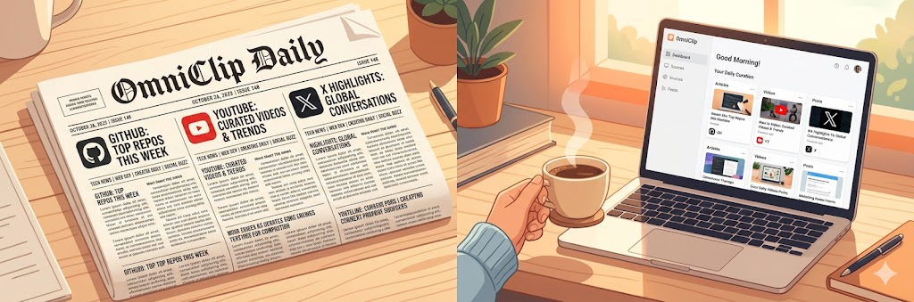
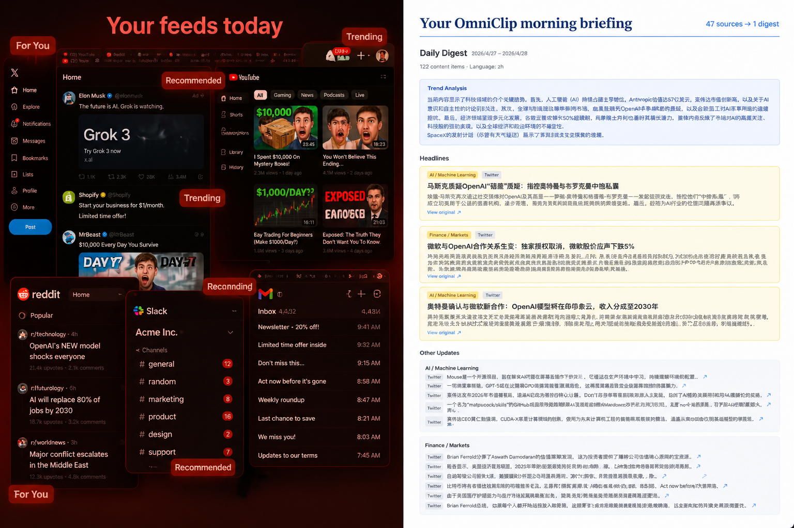
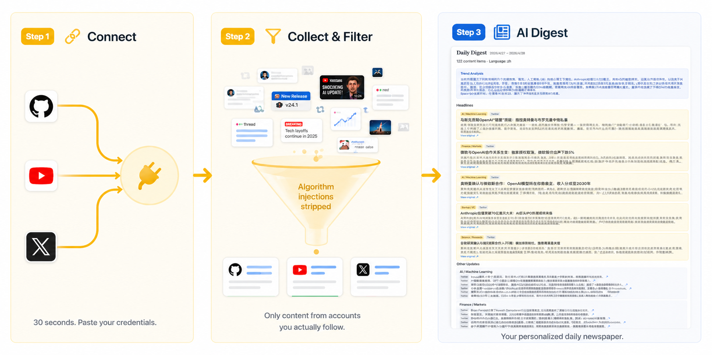
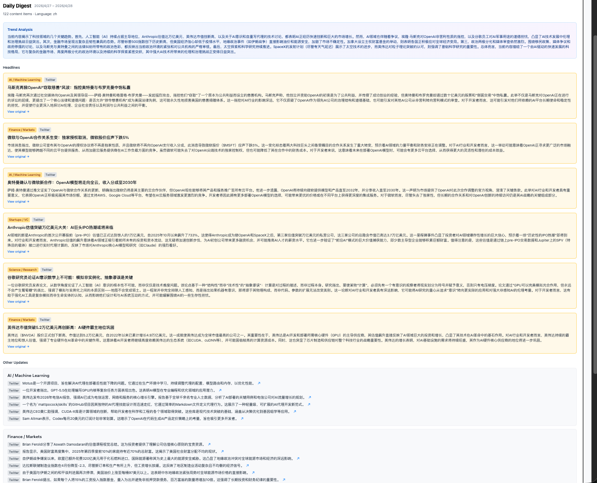
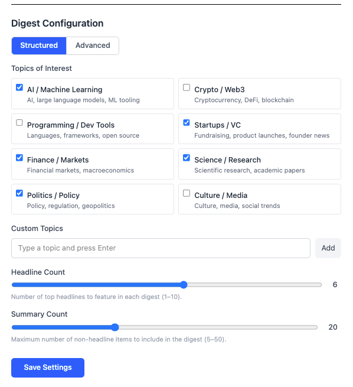

# OmniClip

### Your morning newspaper, assembled by AI, from every corner of the internet you care about.

English | [中文](README_zh.md)

> **Early Development** — OmniClip is at v0.1.0. Features and APIs may change.

---

Every morning, millions of people open Twitter, YouTube, GitHub, and a dozen other apps — not to find what matters, but to survive the algorithmic firehose. You scroll past promoted tweets you never asked for, recommended videos you'll never watch, and trending topics designed to hijack your attention.

**What if you had a personal editor?** Someone who reads everything you actually subscribed to, throws out the noise, and delivers a clean briefing — like a newspaper made just for you.

That's OmniClip.

---

## The Problem

| | Traditional Feeds | OmniClip |
|---|---|---|
| **What you see** | Algorithm decides | You decide |
| **Signal-to-noise** | ~10% relevant | 100% from accounts you follow |
| **Time to consume** | Endless scrolling | 5-minute morning briefing |
| **Promoted content** | Everywhere | Zero |
| **Cross-platform view** | Tab-switching chaos | Single unified digest |

---

## How It Works

**1. Connect** your platforms — GitHub, YouTube, Twitter/X. Just paste your credentials. 30 seconds.

**2. OmniClip filters** — It fetches only content from accounts you actually follow. Algorithmic recommendations, promoted posts, and trending injections are stripped out entirely.

**3. AI assembles your newspaper** — Headlines with deep-dive analysis. Category summaries. Cross-platform trend insights. Delivered as a clean, readable digest.

---

## What Your Newspaper Looks Like

Each digest features:

- **Headlines** — The 3–5 most important items, with journalist-style deep-dive analysis
- **Category Summaries** — Everything else, organized by topic with one-liner summaries
- **Trend Analysis** — AI-generated cross-platform insights connecting the dots

You control how many headlines, how many summaries, and which topics matter to you.

---

## Platform Coverage

OmniClip enforces a simple rule: **only content from accounts you consciously chose to follow.** No exceptions.

| Platform | What OmniClip Reads | What OmniClip Ignores |
|----------|---------------------|----------------------|
| **GitHub** | Releases from your ⭐ Starred repos | Commits, issues, Explore page, trending |
| **YouTube** | Videos from your Subscriptions | Shorts, recommendations, trending |
| **Twitter / X** | Tweets from your Following list | For You, promoted tweets, trending topics |

---

## Customize Your Newspaper

- **Pick your topics** — Choose from presets (AI, Crypto, Open Source, Gaming...) or create your own
- **Control the volume** — Set how many headlines (1–10) and category summaries (5–50) you want
- **Advanced mode** — Write your own AI prompt for complete control over digest style and content

---

## Getting Started

Prerequisites: Node.js 22+, pnpm, Docker.

Detailed setup instructions: **[Setup Guide](docs/setup.md)** | **[Platform Keys Guide](docs/platform-keys-setup.md)**

---

## Architecture

OmniClip is a TypeScript monorepo managed by [Turborepo](https://turbo.build) + pnpm.

| Package | Stack | Role |
|---------|-------|------|
| `packages/backend` | NestJS · Drizzle ORM · BullMQ | API, content aggregation, scheduled jobs |
| `packages/frontend` | Next.js 15 · React 19 · Tailwind CSS 4 | Web UI with i18n (next-intl) |
| `packages/shared` | TypeScript | Shared types and utilities |

**AI** — OpenAI + Google Gemini (bring your own API key).
**Database** — PostgreSQL 16 (via Drizzle ORM) + Redis 7 (job queues & caching).
**Infrastructure** — Docker Compose for local development.

---

## Privacy & Security

OmniClip is fully self-hosted. Your credentials stay on your own infrastructure.

- Platform API keys / tokens are stored in your local PostgreSQL instance
- Zero telemetry — no data is sent to OmniClip or any third party
- AI API calls go directly from your server to OpenAI / Google — no proxy, no middleman

---

## FAQ

**How often is the digest generated?**
Content is fetched on a configurable schedule via BullMQ job queues. You can also trigger a manual refresh.

**Which AI models are supported?**
OpenAI and Google Gemini. You provide your own API key — no built-in account, no usage fees from OmniClip.

**Can I add more platforms?**
The aggregation layer is designed to be extensible. Community contributions for new platforms (Huggingface, Hacker News, Reddit, etc.) are welcome.

**Is this production-ready?**
Not yet. OmniClip is in active early development (v0.1.0). Expect breaking changes.

---

## Roadmap

- [ ] **Digest delivery** — Push digests to Email, Feishu / Lark, Slack, Telegram, and other channels
- [ ] **More platforms** — Hacker News, Reddit, Bilibili, Xiaohongshu, RSS, and community-contributed connectors
- [ ] **Smart recommendations** — Surface content you might have missed based on your reading history, archived items, and interest graph

---

## Contributing

Contributions welcome.

1. Fork the repo, create a feature branch
2. Follow existing conventions — TypeScript strict mode, Prettier formatting
3. Add tests for new features (Vitest for unit, Playwright for e2e)
4. Open a PR with a clear description of what and why

For bugs or feature requests, [open an issue](../../issues).

---

## License

[MIT](LICENSE).
